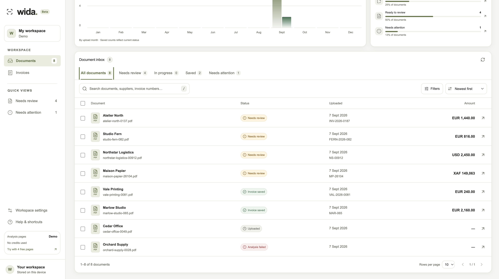
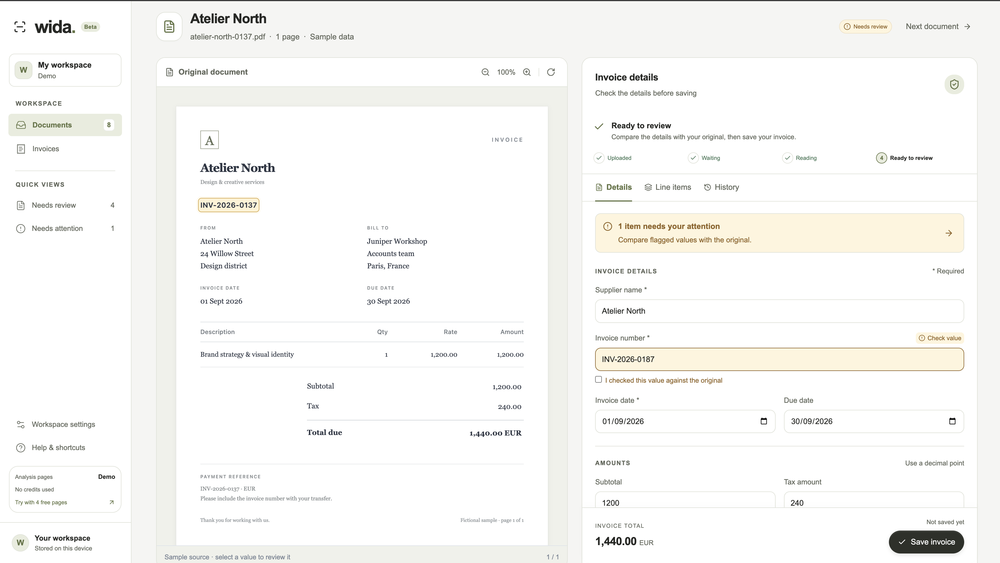

# Wida Frontend

Wida is a document inbox and invoice review workspace built with Next.js, React, and TypeScript. Upload originals, compare extracted invoice details with their source, correct uncertain fields, and keep saved invoices together.



*Current application in demo mode. The suppliers, invoices, and extraction results shown here are fictional.*

## What works

- Google sign-in for invited pilot users, personal document access, and sign-out in live mode.
- Document inbox with search, status tabs, actionable counts, supplier/date sorting, currency and upload-date filters, selection, and client-side pagination.
- Multiple-file upload with drag-and-drop or a file picker: up to 20 PDF, PNG, JPEG, or TIFF files at a time, each up to 20 MiB (shown as 20 MB in the interface).
- Invoice review with original-document preview, confidence indicators, explicit checks for uncertain fields, manual line items, inline validation, and processing history.
- Invoice creation and editing, draft recovery, review-next navigation, and CSV export of saved invoice headers.
- Responsive navigation and review panels, light/dark preferences, and keyboard shortcuts: `/` to search, `U` to upload, and `?` for help.



*Current application: the low-confidence invoice number needs a check against the source before saving.*

The [UI design guide](docs/ui-design.md) explains the workflow, current API integration, remaining work, and original concept. See [development and verification](docs/development.md) for a manual browser checklist and troubleshooting.

## Run the demo

Use **Node.js 22.23.2 or newer supported 22.x, or Node.js 24+**, and **pnpm 12.3.4**. Node.js 22.23.2 is the baseline for the documented development and native TypeScript test commands.

From `wida-front`:

```bash
pnpm install --frozen-lockfile
pnpm dev
```

Open [http://localhost:3000](http://localhost:3000). No environment file or backend is needed for demo mode. To use another port, run `pnpm dev --port 3001`.

The demo starts with eight fictional documents. Edits, saved invoices, and drafts use this browser origin's local storage; files you upload are kept in IndexedDB. New uploads have empty invoice fields for manual entry. Only the seeded examples demonstrate extraction: the demo does not send your files to an extraction service or invent results for them.

Browser data is local to that browser and origin. Clearing site data removes the demo records and uploaded originals. See [storage and reset](docs/development.md#storage-and-reset) before resetting a workspace.

## Connect the API

Configure and start the Wida API, including PostgreSQL, using its own README. From the backend repository, use the local HTTP launch profile:

```bash
dotnet run --project Wida.Api --launch-profile http
```

In `wida-front`, copy [.env.example](.env.example) to `.env.local` and set the **server-only** API origin, without an `/api` suffix:

```dotenv
WIDA_API_URL=http://localhost:5085
WIDA_PUBLIC_ORIGIN=http://localhost:3000
```

Restart the frontend server. The live workspace requires Google sign-in with an invited account. Configure the Google client credentials, pilot invitations, and `Authentication:PublicOrigin` in the API as described in its README. Register `http://localhost:3000/api/wida/auth/callback` as the Google OAuth redirect URI for local development. Credentials belong only in the backend's secrets; no Google client secret is configured in Next.js. If Google is not configured, Wida shows a configuration message and keeps document access protected.

`WIDA_PUBLIC_ORIGIN` is the public frontend origin and must equal the API's `Authentication:PublicOrigin`. It is required for live production and should use HTTPS on a shared deployment. For a different local frontend port, update these two values and the Google redirect URI together.

The workspace loads only the signed-in user's documents; it does not merge demo records into the backend. Automatic extraction additionally needs the API's Azure Document Intelligence configuration. Without Azure configuration, signed-in users can upload files and enter invoice details manually.

The browser calls the same-origin `/api/wida/...` route. Its Next.js server proxy forwards supported `GET`, `POST`, and `PUT` requests to the configured backend, including streaming uploads, original files, byte ranges, and Wida session cookies. The live workspace first requests `/api/wida/auth/session`; mutating requests include the returned `X-CSRF-TOKEN` and same-origin credentials. Authentication and ownership checks run in the API, including for originals and analysis history. Keep the API URL on the server; no `NEXT_PUBLIC_` variable is needed.

The proxy permits the controlled Google login/callback redirects and refuses redirects from ordinary data routes. For local development, use the HTTP launch profile above; for HTTPS, use an endpoint with a certificate trusted by the frontend's Node.js process. An unexpected redirect or untrusted certificate appears as an API connection error.

## Demo and live behavior

| Behavior | Demo | Live API |
| --- | --- | --- |
| Access | No account needed | Google account invited to the pilot |
| Starting data | Eight fictional documents | Latest 500 documents from the workspace endpoint |
| Original files | Generated sample illustrations; user uploads in IndexedDB | Backend file-content endpoint |
| Extraction | Seeded sample results; new uploads use manual entry | Explicit analysis request, optionally after upload |
| Saved invoices | Local storage | API `POST` or `PUT` |
| Unsaved drafts and field checks | Local storage | Session storage scoped to the signed-in user in the current tab |
| Theme preference | Local storage | Local storage |
| CSV export | Generated in the browser | Generated in the browser from loaded records |

Search, counts, filters, pagination, and exports operate on the loaded workspace. In live mode this is the latest 500 documents, not the full database. Export includes saved records matching the current filters across client pages, or the selected subset when a selection is active; line items are not included in the CSV.

## Commands

| Command | Purpose |
| --- | --- |
| `pnpm dev` | Start development mode. |
| `pnpm lint` | Run ESLint. |
| `pnpm test` | Run form, API-adapter, and workspace-state tests with Node's test runner. |
| `pnpm exec next typegen` | Generate Next.js route types. |
| `pnpm exec tsc --noEmit` | Check TypeScript after route types exist. |
| `pnpm build` | Create a production build. |
| `pnpm start` | Serve an existing production build. |

The test script runs `node --experimental-strip-types --test tests/*.test.mjs`. Linting is separate from the Next.js build. The layout uses system fonts and does not download Google Fonts during compilation.

## Project structure

```text
app/
  page.tsx                   Selects demo or live workspace
  login/page.tsx             Google login errors and session check
  layout.tsx                 Wida metadata and root layout
  globals.css                Workspace styles and theme tokens
  api/wida/[...path]/route.ts Server-side API proxy
components/
  auth-gate.tsx              Live session gate, login, and session expiry
  workspace.tsx              Inbox, navigation, persistence, and actions
  upload-dialog.tsx          Multiple-file upload workflow
  invoice-review.tsx         Editable invoice, validation, and history
  document-preview.tsx       Sample, image, and native PDF previews
lib/                        API client, contracts, demo data, form helpers, storage
tests/                      Form, API-adapter, and workspace-state unit tests
docs/                       UI guide, development notes, screenshots, original concept
.env.example                Server-only API origin example
```

The UI uses native HTML controls, custom styles, and `lucide-react` icons. shadcn/ui is a design reference, not an installed dependency. The `@/*` import alias resolves from the repository root.

## Current limits

The API extracts seven header fields from the first analyzed document; line items remain manual. Live PDFs use the browser's PDF viewer. Field-to-source highlighting is demonstrated on sample invoices, but live extraction polygons are not drawn. Image and sample previews have custom zoom and rotation controls; PDF controls depend on the browser. TIFF preview support also depends on the browser.

There is no background processing worker, approval/rejection workflow, or server-persisted draft and field-review audit trail. **Extraction completed**, **checked in the form**, and **invoice saved** are separate events. Live PostgreSQL, Azure, and Google end-to-end validation must be performed in a configured environment; screenshots of the demo do not establish that integration result.

An expired session closes the live workspace and preserves drafts under their owner's id so the same account can recover them after signing in again. Explicit sign-out warns about unsaved drafts and removes that account's drafts from the current tab. Other open tabs close their workspace when the account changes or signs out, retaining only owner-scoped draft recovery data to avoid silently discarding their unsaved edits; session checks on focus provide a fallback. Draft recovery is browser-local and cannot protect unsaved changes if storage is unavailable.

## Contributing

Update the docs when routes, environment settings, or behavior change. Run lint, the form tests, TypeScript checks, and a production build for application changes, then use the [browser checklist](docs/development.md#manual-browser-checklist) for affected workflows. Commit lockfile changes when dependencies change.

Coding agents should read [AGENTS.md](AGENTS.md) and the relevant version-specific guides in `node_modules/next/dist/docs/` before changing application code.

## Licence

This project is licensed under the [MIT Licence](LICENSE).
