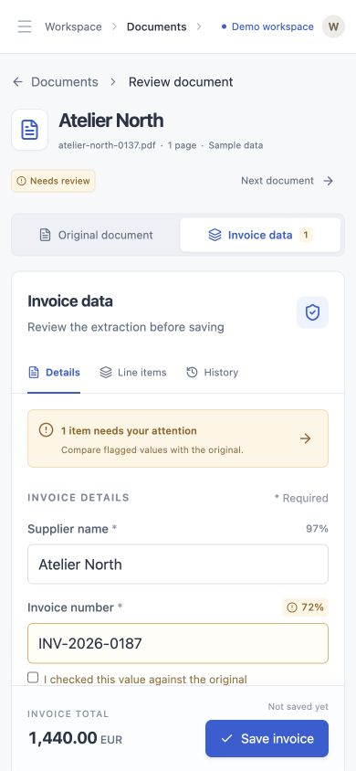
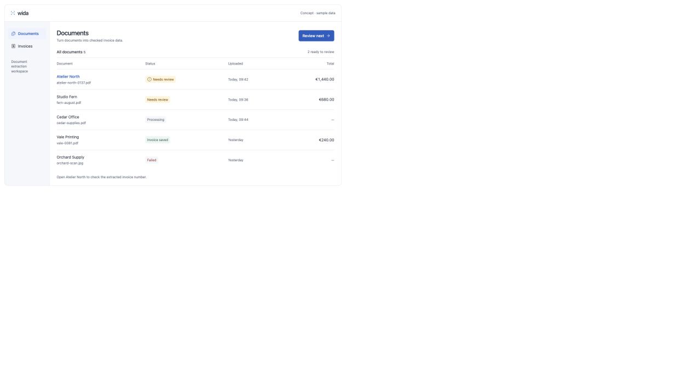
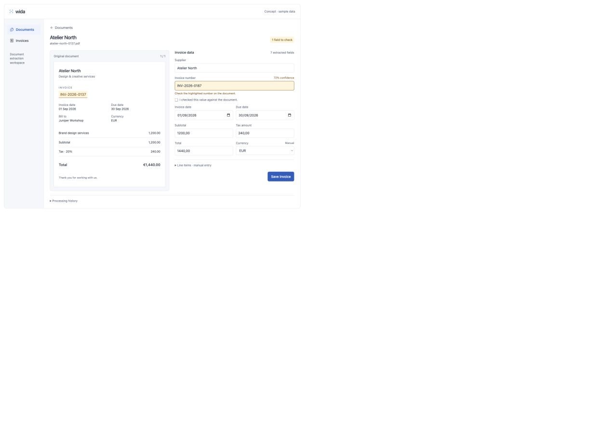

# Wida UI and workflow

**Wida centers on a document inbox and side-by-side invoice review.** The interface helps users find work needing attention, compare extracted values with the original, correct mistakes, and save reliable invoice data.

This guide describes the implemented frontend as of 8 September 2026, then preserves the original concept for design context. See the [frontend README](../README.md) to run the demo or connect the API.

## Users and priorities

The working audience is finance or operations staff processing supplier invoices. Their repeated task is to turn a PDF or image into a checked invoice without losing its source context.

The interface prioritizes three questions: **What needs my attention? Is this value correct? Was the invoice saved?** More detailed approval hierarchies and reporting remain future product decisions.

```text
Upload document → Extract or enter details → Review and correct → Save invoice
                             ↓                                      ↓
                        Retry if failed                        Edit or export
```

## Current application

The Next.js application implements the workflow in demo and live modes. Demo data is fictional and persists locally; live mode uses the configured Wida API. It is no longer the starter page or the standalone concept below.

### Documents: the home screen


*Application screenshot in its initial demo state. The sample records illustrate review, saved, uploaded, and failed states.*

The inbox provides search by document, supplier, invoice number, or currency; status tabs; currency and upload-date filters; supplier or upload-time sorting; multiple selection; and 10/25/50-row pagination. Queue counts and review actions help users move directly to eligible documents.

The upload dialog accepts up to 20 files at a time, each at most 20 MiB, in PDF, PNG, JPEG, or TIFF format. It supports drop and file-picker input, per-file progress, and recoverable failures. Live uploads can request extraction after the file is stored. Demo uploads retain the actual file and open blank invoice fields for manual entry.

Live mode requests `GET /api/documents/workspace?limit=500`. Search, counts, filters, pagination, and CSV export operate on this loaded subset; they do not search every record in a larger database.

### Invoice review: the primary workspace


*Application screenshot in demo mode before correction. Extraction confidence remains visible after a human check.*

Desktop review places the source on the left and the form on the right. The form has **Details**, **Line items**, and **History** tabs. Required and missing values are visible, uncertain fields have explicit checkboxes, and validation errors link back to fields. Saved records can be reopened and updated.

The source panel renders fictional sample invoices, uploaded images, or the original PDF through the browser's native viewer. Custom zoom and rotation apply to images and sample invoices; PDFs use their native viewer controls. Sample source values link to the corresponding form fields. Live PDF/image extraction polygons are not yet rendered.

The application saves drafts after edits: local storage in demo mode and session storage in live mode. Successful saves create or update an invoice and clear its draft. Field checkboxes support the current review session; the backend does not retain those decisions as an audit trail.

### Invoices: saved records

The Invoices view lists saved records from the loaded workspace. Users can search, filter, open, correct, and export them. CSV export includes saved invoice headers matching the current filters across client pages, or the selected subset when a selection is active. It does not export line items.

Invoice creation uses `POST /api/invoices`; editing uses `PUT /api/invoices/{id}`. The update sends the complete editable header and line collection. The API permits one invoice per document and preserves the invoice ID when it is updated.

## Status and validation

Machine extraction, human checking, and invoice persistence are distinct:

| State or label | Meaning |
| --- | --- |
| Uploaded | The file and metadata were stored. Upload alone does not perform analysis. |
| Processing | A processing run is in progress; manual pending runs do not run automatically. |
| Extraction completed | The run is `Completed`; this does not mean a human checked it or an invoice was saved. |
| Needs review | An unsaved document has completed extraction. Missing or uncertain fields still require attention. |
| Checked against the original | A local form acknowledgement. Editing the field clears its acknowledgement. |
| Invoice saved | An invoice record exists. This is not a formal approval. |
| Extraction failed | The latest run failed; history exposes its reason and a retry action. |

The API now transitions unsaved documents through `Processing` to `ReviewRequired` or `Failed`, and invoice saves set `Saved`. Reanalysis preserves an already saved document's `Saved` status while the run records its own result. The UI prioritizes an existing saved invoice when deriving the workspace label. `Approved` and `Rejected` remain reserved backend enum values without implemented actions.

An extracted field requires a check when its confidence is absent or below `0.80`; exactly `0.80` does not trigger it. Missing fields are omitted from extraction results, so the form separately validates absent required values. A `Completed` run can contain no extracted fields.

Client validation requires supplier name, invoice number, invoice date, and total. It also checks real calendar dates, due-date order, numeric values, currency format, header arithmetic, line multiplication, and the sum of line amounts. Arithmetic comparisons use the API's inclusive `0.01` tolerance. The backend additionally validates persistence limits and returns structured field errors. These checks do not replace source comparison or provide a formal approval decision.

## Extraction and manual fields

The analyzer selects seven header fields from the first analyzed document:

| Extraction field | Invoice field |
| --- | --- |
| `VendorName` | `supplierName` |
| `InvoiceId` | `invoiceNumber` |
| `InvoiceDate` | `invoiceDate` |
| `DueDate` | `dueDate` |
| `SubTotal` | `subtotalAmount` |
| `TotalTax` | `taxAmount` |
| `InvoiceTotal` | `totalAmount` |

The form maps typed `normalizedValue` data, including currency amount objects, and falls back to raw text when available. Supplier address, tax ID, purchase order, and line items are entered manually. Currency can be taken from a returned currency object or entered by the user; the currencies shown in screenshots are fictional examples.

## Current API support and remaining work

| UI requirement | Current support | Remaining work |
| --- | --- | --- |
| Upload and rich inbox rows | Upload validation and bounded workspace summary endpoint | Server-side search, filtering, and pagination beyond the latest 500 documents |
| Original source | File-content endpoint with byte ranges; native PDF and image preview | Cross-browser TIFF handling beyond the open-original fallback |
| Extraction and history | Analysis creation and processing-run reads | Background worker, run resumption, and stronger interrupted-request recovery |
| Field evidence | Optional `pageNumber` and first-region `boundingBox` in the API; interactive sample source | Page dimensions/units/orientation or normalized coordinates, plus live polygon rendering |
| Saved invoice records | Create, read, list, and full update endpoints; UI create/edit and loaded-record listing | Independent full invoice collection browsing beyond the loaded document subset |
| Validation | Structured server field errors and client form checks | Continued parity checks as invoice rules change |
| Drafts and checks | Browser draft storage and explicit field acknowledgements | Server-persisted drafts, reviewer decisions, and an audit trail |
| Export | Browser-generated CSV of loaded saved invoice headers | Line-item export or a server export endpoint if needed |

The API has no authentication, approval/rejection workflow, or background worker. Do not infer live PostgreSQL/Azure integration success from the demo screenshots; verify those services in a configured environment using the [development checklist](development.md).

## Visual and responsive decisions

The implemented interface uses neutral surfaces, dark readable text, restrained blue actions, amber review prompts, red failures, and green saved confirmation. Text and icons accompany colors. Amounts align consistently; unknown amounts appear as an em dash. The UI includes visible focus, native modal dialogs, and save/error announcements.

Desktop review uses two fixed grid columns. On screens at or below 820 px, **Original document** and **Invoice data** controls switch between panels; they avoid squeezing both into a narrow screen. The inbox reduces secondary columns and uses collapsible navigation. Theme preference persists in local storage.



*Current mobile application in demo mode. Switch to Original document to compare the source without losing the draft.*

The implementation uses Next.js, React, TypeScript, Tailwind, native HTML controls, custom CSS, system fonts, and `lucide-react`. A keyboard-operable resizable divider remains a future enhancement. shadcn/ui is not installed.

## Original concept archive

The following images preserve the earlier design exploration. They contain five fictional documents and show the standalone prototype, not the current application or real customer data.



*Original inbox concept: a compact queue focused on opening the next review.*



*Original review concept: correct the extracted invoice number against the highlighted source.*


*Original mobile concept used a vertical stack; the implemented mobile interface switches between document and data panels.*

Open the [standalone concept](prototypes/invoice-workspace.html) in a browser to explore it. Choose **Atelier North**, correct its number to `INV-2026-0137`, confirm the check, and save. This historical prototype updates only its current page state and resets on reload. It does not upload files, call the API, or implement the current application's search, validation, or storage behavior. [Screenshot provenance](images/README.md) records the sources and capture details.

## Design references

- [Docsumo review screen](https://support.docsumo.com/docs/review-screen-overview): original documents alongside extracted fields, with review and confirmation controls.
- [Rossum document validation screen](https://knowledge-base.rossum.ai/docs/document-validation-screen-in-rossum): document viewer controls, supporting details, and confirmation behavior.
- [shadcn/ui Resizable](https://ui.shadcn.com/docs/components/base/resizable): an implementation reference for a future keyboard-operable divider.

These references informed the interaction pattern; the Wida screenshots show original designs tailored to its workflow.
